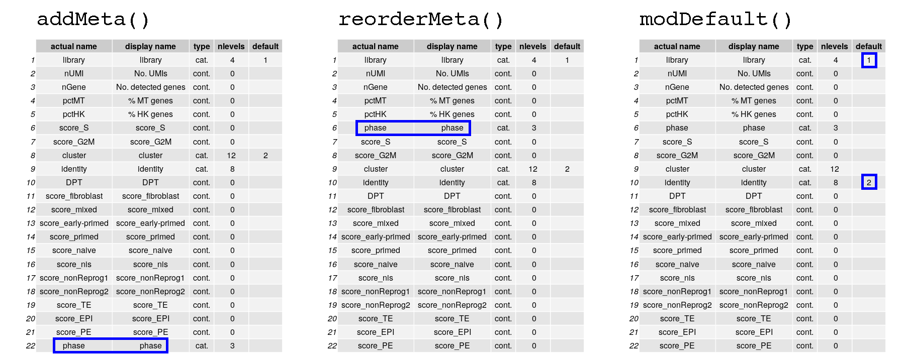
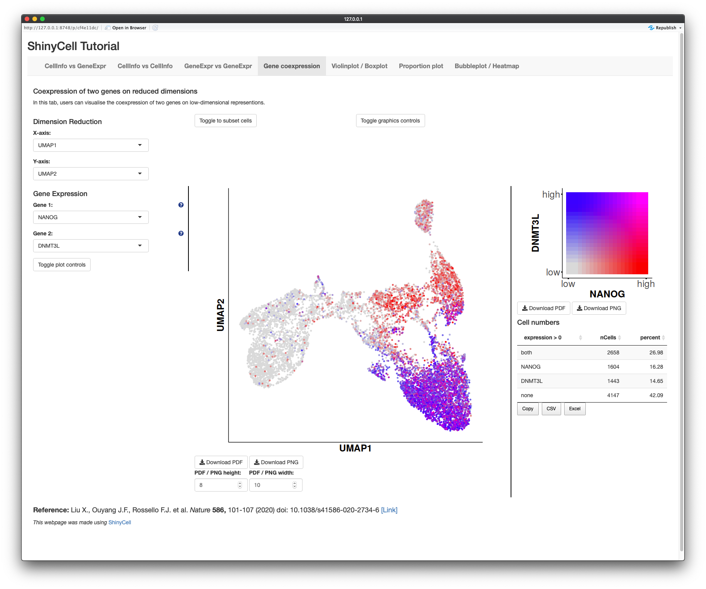
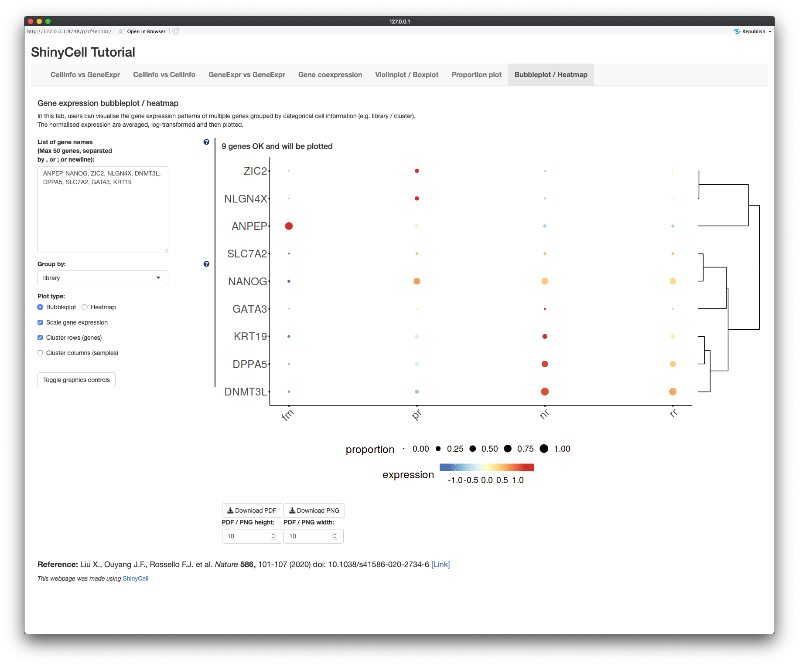

Here, we present a detailed walkthrough on how `ShinyCell` can be used to 
create a Shiny app from single-cell data objects. In particular, we will focus 
on how users can customise what metadata is to be included, their labels and 
colour palettes. A live version of the shiny app generated here can be found at 
[shinycell1.ddnetbio.com](http://shinycell1.ddnetbio.com).

To demonstrate, we will use single-cell data (Seurat object) containing 
intermediates collected during the reprogramming of human fibroblast into 
induced pluripotent stem cells using the RSeT media condition, taken from 
[Liu, Ouyang, Rossello et al. Nature (2020)](
https://www.nature.com/articles/s41586-020-2734-6). The Seurat object can be 
[downloaded here](http://files.ddnetbio.com/hrpiFiles/readySeu_rset.rds).


## Load data and create ShinyCell configuration
First, we will load the Seurat object and run `createConfig()` to create a 
ShinyCell configuration `scConf`. The `scConf` is a data.table containing (i) 
the single-cell metadata to display on the Shiny app, (ii) ordering of factors 
/ categories for categorical metadata e.g. library / cluster and (iii) colour 
palette associated with each metadata. Thus, `scConf` acts as an "instruction 
manual" to build the Shiny app without modifying the original single-cell data.

``` r
library(Seurat)
library(ShinyCell)

# Create ShinyCell config
getExampleData()                       # Download example dataset (~200 MB)
seu <- readRDS("readySeu_rset.rds")
scConf = createConfig(seu)
```

To visualise the contents of the Shiny app prior to building the actual app, 
we can run `showLegend()` to display the legends associated with all the 
single-cell metadata. This allows users to visually inspect which metadata to 
be shown on the Shiny app. This is useful for identifying repetitive metadata 
and checking how factors / categories for categorical metadata will look in 
the eventual Shiny app. Categorical metadata and colour palettes are shown 
first, followed by continuous metadata which are shown collectively. 

``` r
showLegend(scConf)
```


## Add / remove / modify metadata and colour palette
It is possible to modify `scConf` directly but this might be prone to error. 
Thus, we provided numerous convenience functions to modify `scConf` and 
ultimately the Shiny app. In this example, we note that the `orig.ident` and 
`library` as well as `RNA_snn_res.0.5` and `cluster` metadata are similar. To 
exclude metadata from the Shiny app, we can run `delMeta()`. Furthermore, we 
can modify how the names of metadata appear by running `modMetaName()`. In 
this case, we changed the names of some metadata to make them more meaningful. 

By default, colours for categorical metadata are generated by interpolating 
colours from the "Paired" colour palette in the RColorBrewer package. To 
modify the colour palette, we can run `modColours()`. Here, we changed the 
colours for the library metadata to match that in the publication. It is also 
possible to modify the labels for each category via `modLabels()`. For 
example, we changed the labels for the library metadata from upper case to 
lower case. After modifying `scConf`, it is reccomended to run `showLegend()` 
to inspect the changes made.

``` r
# Delete excessive metadata and rename some metadata
scConf = delMeta(scConf, c("orig.ident", "RNA_snn_res.0.5", "phase"))
scConf = modMetaName(scConf, 
                     meta.to.mod = c("nUMI", "nGene", "pctMT", "pctHK"), 
                     new.name = c("No. UMIs", "No. detected genes",
                                  "% MT genes", "% HK genes"))
showLegend(scConf)

# Modify colours and labels
scConf = modColours(scConf, meta.to.mod = "library", 
                    new.colours= c("black", "darkorange", "blue", "pink2"))
scConf = modLabels(scConf, meta.to.mod = "library", 
                   new.labels = c("fm", "pr", "nr", "rr"))
showLegend(scConf)
```


## Change order of appearance of metadata and defaults
Apart from `showLegend()`, users can also run `showOrder()` to display the 
order in which metadata will appear in the dropdown menu when selecting which 
metadata to plot in the Shiny app. A table will be printed showing the actual 
name of the metadata in the single-cell object and the display name in the 
Shiny app. The metadata type (either categorical or continuous) is also 
provided with the number of categories "nlevels". Finally, the "default" 
column indicates which metadata are the primary and secondary default.

``` r
showOrder(scConf)
```


Here, we introduce a few more functions that might be useful in modifying the 
Shiny app. Users can add metadata back via `addMeta()`. The newly added 
metadata (in this case, the phase metadata) is appended to the bottom of the 
list as shown by `showOrder()`. Next, we can reorder the order in which 
metadata appear in the dropdown menu in the Shiny app via `reorderMeta()`. 
Here, we shifted the phase metadata up the list. Finally, users can change the 
default metadata to plot via `modDefault()`. Again, it is reccomended to run 
`showOrder()` frequently to check how the metadata is changed.

``` r
# Add metadata back, reorder, default
scConf = addMeta(scConf, "phase", seu) 
showOrder(scConf)
scConf = reorderMeta(scConf, scConf$ID[c(1:5,22,6:21)])
showOrder(scConf)
scConf = modDefault(scConf, "library", "identity")
showOrder(scConf)
```




## Generate Shiny app
After modifying `scConf` to one's satisfaction, we are almost ready to build 
the Shiny app. Prior to building the Shiny app, users can run `checkConfig()` 
to check if the `scConf` is ready. This is especially useful if users have 
manually modified the `scConf`. Users can also add a footnote to the Shiny app 
and one potential use is to include the reference for the dataset. Here, we 
provide an example of including the citation as the Shiny app footnote.

``` r
# Build shiny app
checkConfig(scConf, seu)
footnote = paste0(
  'strong("Reference: "), "Liu X., Ouyang J.F., Rossello F.J. et al. ",',
  'em("Nature "), strong("586,"), "101-107 (2020) ",',
  'a("doi:10.1038/s41586-020-2734-6",',
  'href = "https://www.nature.com/articles/s41586-020-2734-6",',
  'target="_blank"), style = "font-size: 125%;"'
)
```

Now, we can build the shiny app! A few more things need to be specified here. 
In this example, the Seurat object uses Ensembl IDs and we would like to 
convert them to more user-friendly gene symbols in the Shiny app. `ShinyCell` 
can do this conversion (for human and mouse datasets) conveniently by 
specifying `gene.mapping = TRUE`. If your dataset is already in gene symbols, 
you can leave out this argument to not perform the conversion. Furthermore, 
`ShinyCell` uses the "RNA" assay and "data" slot in Seurat objects as the gene 
expression data. If you have performed any data integration and would like to 
use the integrated data instead, please specify `gex.assay = "integrated`. 
Also, default genes to plot can be specified where `default.gene1` and 
`default.gene2` corresponds to the default genes when plotting gene expression 
on reduced dimensions while `default.multigene` contains the default set of 
multiple genes when plotting bubbleplots or heatmaps. If unspecified, 
`ShinyCell` will automatically select some genes present in the dataset as 
default genes.

``` r
makeShinyApp(seu, scConf, gene.mapping = TRUE, 
             gex.assay = "RNA", gex.slot = "data",
             shiny.title = "ShinyCell Tutorial",
             shiny.dir = "shinyApp/", shiny.footnotes = footnote,
             default.gene1 = "NANOG", default.gene2 = "DNMT3L",
             default.multigene = c("ANPEP","NANOG","ZIC2","NLGN4X","DNMT3L",
                                   "DPPA5","SLC7A2","GATA3","KRT19")) 
```

Under the hood, `makeShinyApp()` does two things: generate (i) the data files 
required for the Shiny app and (ii) the code files, namely `server.R` and 
`ui.R`. The generated files can be found in the `shinyApp/` folder. To run the 
app locally, use RStudio to open either `server.R` or `ui.R` in the shiny app 
folder and click on "Run App" in the top right corner. The shiny app can also 
be deployed via online platforms e.g. [shinyapps.io](https://www.shinyapps.io/) 
or hosted via Shiny Server. The shiny app look like this, containing five tabs. 
Cell information and gene expression are plotted on UMAP in the first tab while 
two different cell information / gene expression are plotted on UMAP in the 
second / third tab respectively. Violin plot or box plot of cell information or 
gene expression distribution can be found in the fourth tab. Lastly, a 
bubbleplot or heatmap can be generated in the fifth tab. 
A live version of the shiny app can be found at 
[shinycell1.ddnetbio.com](http://shinycell1.ddnetbio.com).

With the Shiny app, users can interactively explore their single-cell data, 
varying the cell information / gene expression to plot. Furthermore, these 
plots can be exported into PDF / PNG for presentations / publications. Users 
can also click on the "Toggle graphics controls" or "Toggle plot controls" to 
fine-tune certain aspects of the plots e.g. point size.








